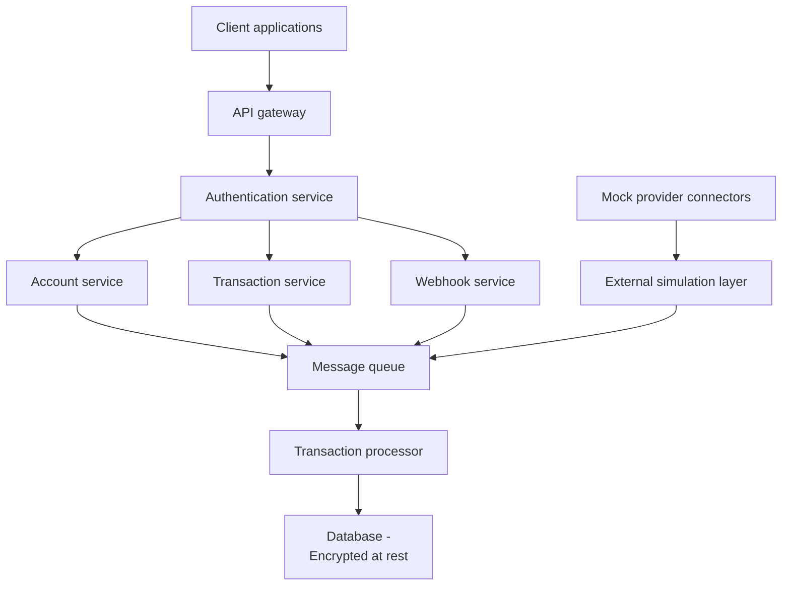

# Financial data aggregation API (PoC)

This project is a proof-of-concept (PoC) API platform that demonstrates secure, scalable financial data aggregation patterns for modern fintech applications.

The system simulates a unified API layer over multiple mock financial providers, showcasing industry-standard architectural patterns including asynchronous processing, OAuth2 authentication, and webhook delivery.

This PoC is designed to demonstrate:

- Unified API layer patterns over multiple financial providers.
- Secure user authorization and consent handling.
- Scalable transaction ingestion architectures.
- Reliable webhook-based event delivery systems.

## Architecture

### Core components

For detailed component specifications and interactions, see the ["Core components" section of the design document](design-doc.md#3-core-components).

## Project documentation

For complete project details, see:

- **[Product requirements document](product-requirements-doc.md):** Functional requirements, success metrics, and testing approach
- **[Design document](design-doc.md):** System architecture, technology stack, security considerations, and implementation details

## Development status

For detailed development milestones and project planning, see [Milestones](https://github.com/josh-wong/financial-data-platform-poc/milestones).

## Contributing

This project is currently in the design phase. Implementation will begin soon based on the requirements and design documents. For questions or suggestions about the design, please [submit an issue](https://github.com/josh-wong/financial-data-platform-poc/issues).

## License

For details, see [LICENSE](LICENSE).
