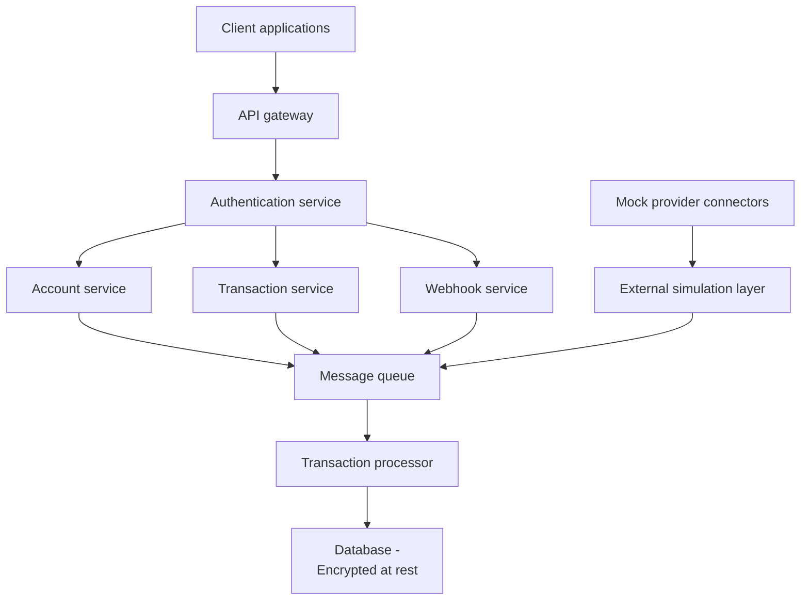

# Design document - Financial data aggregation API (PoC)

This design document describes the architecture, components, and design decisions for the financial data aggregation API proof of concept (PoC).

## 1. High-level architecture

The following diagram and description outline the high-level architecture of the system:



## 2. Architectural principles

The system is designed with the following architectural principles in mind:

- Stateless API services
- Horizontal scalability
- Asynchronous event processing
- Clear separation of concerns
- Security-first design

## 3. Core components

The core components of the system are described below.

### 3.1 API gateway

- Handles routing.
- Enforces authentication.
- Applies rate limiting.

### 3.2 Authentication service

- Issues OAuth2 access tokens via client credentials flow.
- Validates access tokens.
- Manages API client credentials and secrets.

### 3.3 Account service

- Stores linked account metadata.
- Manages user-to-account relationships.

### 3.4 Transaction service

- Retrieves stored transaction data.
- Supports filtering and pagination.

### 3.5 Mock provider connectors

- Simulate 3 distinct financial institution APIs (example: "Mock Bank A", "Mock Credit Union B", "Mock Fintech C").
- Periodically generate realistic transaction data.
- Provide different account types and transaction patterns per provider.

### 3.6 Message queue

- Decouples ingestion from processing.
- Buffers transaction updates.

### 3.7 Transaction processor

- Normalizes provider data.
- Ensures idempotency.
- Stores transactions.

### 3.8 Webhook service

- Registers webhook endpoints.
- Sends event notifications.
- Implements retry + exponential backoff.
- Uses idempotency keys.

## 4. Data model (simplified)

The following shows a simplified data model for the system.

### User

`User` entity fields:

- `id`
- `email`
- `created_at`

### Account

`Account` entity fields:

- `id`
- `user_id`
- `provider_name`
- `external_account_id`
- `balance`
- `linked_at`

### Transaction

`Transaction` entity fields:

- `id`
- `account_id`
- `amount`
- `currency`
- `description`
- `timestamp`
- `provider_transaction_id`

### WebhookSubscription

`WebhookSubscription` entity fields:

- `id`
- `user_id`
- `callback_url`
- `secret`
- `created_at`

## 5. API design (example endpoints)

Example API endpoints:

```markdown
POST /auth/token
POST /accounts/link
GET  /accounts
GET  /accounts/{id}/transactions
POST /webhooks
DELETE /webhooks/{id}
```

Webhook event:

```json
POST {client_webhook_url}
{
  "event_type": "transaction.created",
  "account_id": "...",
  "transaction_id": "...",
  "timestamp": "..."
}
```

## 6. Scalability strategy

For this PoC, scalability strategies focus on demonstrating patterns rather than production scale:

- Stateless API layer design (enabling future horizontal scaling)
- Simple caching layer (Redis) for account balances
- Asynchronous processing via message queue
- Configurable rate limiting (default: 1,000 requests per hour per client)
- Modular architecture to support future scaling

## 7. Reliability strategy

Reliability strategies for the PoC include:

- Message queue ensures basic durability.
- Simple retry logic for webhook delivery (target >95% delivery success rate).
- Basic logging and monitoring.
- Idempotency keys to prevent duplicate processing.

## 8. Security considerations

Security considerations include:

- OAuth2 client credentials flow for API authentication.
- HTTPS required.
- Encrypted database storage.
- Webhook signature verification (HMAC).
- Least-privilege service permissions.

## 9. Error handling strategy

Error handling approach for the PoC:

- Standard HTTP status codes (400, 401, 403, 404, 500, etc.)
- Consistent error response format with error codes and messages
- Clear error descriptions for common integration issues
- Graceful handling of mock provider failures
- Webhook delivery failure handling with basic retry logic
- Standardized error response schema:

  ```json
  {
    "error": {
      "code": "string",
      "message": "string", 
      "details": "string (optional)"
    }
  }
  ```

## 10. Observability

Observability features for the PoC include:

- API request/response logging with correlation IDs.
- Webhook delivery success/failure tracking.
- System health endpoints for monitoring.
- Performance metrics (request count, latency, throughput, error rates).
- Alerting for critical system failures.
- Webhook delivery status monitoring.

## 11. Technology stack (suggested)

Suggested technology stack for the PoC:

- **Backend:** FastAPI (Python) for rapid development
- **Database:** PostgreSQL
- **Cache:** Redis (optional for basic caching)
- **Queue:** Lightweight option like Redis queues or RabbitMQ
- **OpenAPI:** Auto-generated via FastAPI

## 12. Project milestones

The development of this financial data platform is organized into structured milestones that ensure systematic progress from initial documentation through final deployment.

Key milestone phases:

- **Milestone 1:** Project documentation (PRD, design documents)
- **Milestone 2:** Infrastructure setup (database, Docker, Redis)
- **Milestone 3:** Authentication system (OAuth2 implementation)
- **Milestone 4:** Core API services (accounts, transactions)
- **Milestone 5:** Mock provider integration (3 financial providers)
- **Milestone 6:** Transaction processing (message queue, async processing)
- **Milestone 7:** Webhook system (notifications, retry logic)
- **Milestone 8:** Testing and documentation (OpenAPI, comprehensive testing)
- **Milestone 9:** Final integration and deployment preparation

For details about these milestones, see [Milestones](https://github.com/josh-wong/financial-data-platform-poc/milestones) in this repository.

## 13. Tradeoffs

The following key tradeoffs were considered.

### 13.1 Monolith vs. microservices

Comparison:

- Start modular monolith for simplicity.
- Extract services as scale increases.

### 13.2 Strong vs. eventual consistency

Consistency considerations:

- Eventual consistency acceptable for transactions.
- Strong consistency required for authentication.

## 14. Deployment

Deployment details:

- Containerized services (Docker)
- Reverse proxy (NGINX)
- Single-region deployment (PoC)
- Infrastructure-as-code optional

## 15. Testing strategy

Testing approach for the PoC:

- **Mock provider testing**: Verify data ingestion from 3 different mock providers.
- **Webhook reliability testing**: Validate webhook delivery for different scenarios.
- **API endpoint testing**: Ensure all core endpoints function correctly.
- **End-to-end workflow testing**: Validate complete user journey (account linking → transaction retrieval → webhook delivery).
- **OpenAPI compliance**: Verify actual API responses match OpenAPI specification.

## 16. Future enhancements

- Multi-region deployment simulation
- Advanced rate-limiting strategies
- Dashboard for analytics
- Event streaming support
- Enhanced mock provider scenarios
- API analytics and usage metrics
- Advanced security features (example: OAuth2 scopes, role-based access control)
- Automated API documentation generation
